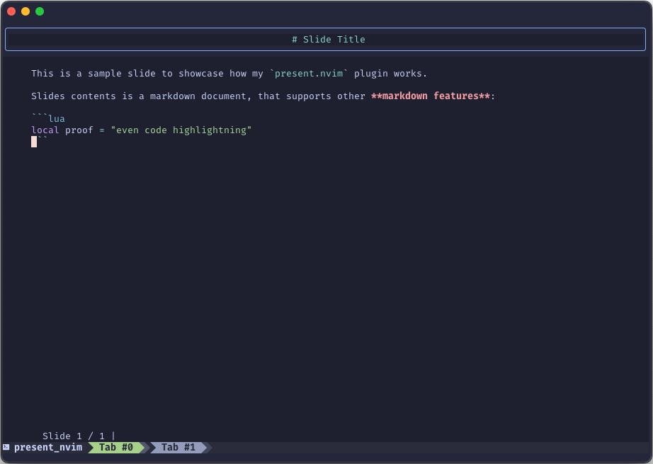

# `present.nvim`

This is my silly presentation plugin for Neovim that I made while I was following Teej's [2024 Advent of Neovim](https://www.youtube.com/playlist?list=PLep05UYkc6wTyBe7kPjQFWVXTlhKeQejM). You can find his implementation [here](https://github.com/tjdevries/present.nvim).



## How to use?

Create a markdown file. Each 1st level heading would be a slide's title, after which comes slide body. For example:


```markdown
# First slide's title

First slide contents.

# Second slide title.

Second slide contents.

- It might be multiline
- You may use other markdown features, such as lists, codeblocks etc.
```

Once you have this file, you can run `:PresentStart` command and it will try to run a presentation on your current buffer.
`PresentStart` also accepts buffer number as _optional_ first parameter, e.g. `:PresentStart 42` will try to read and parse buffer number 42 as a presentation.
